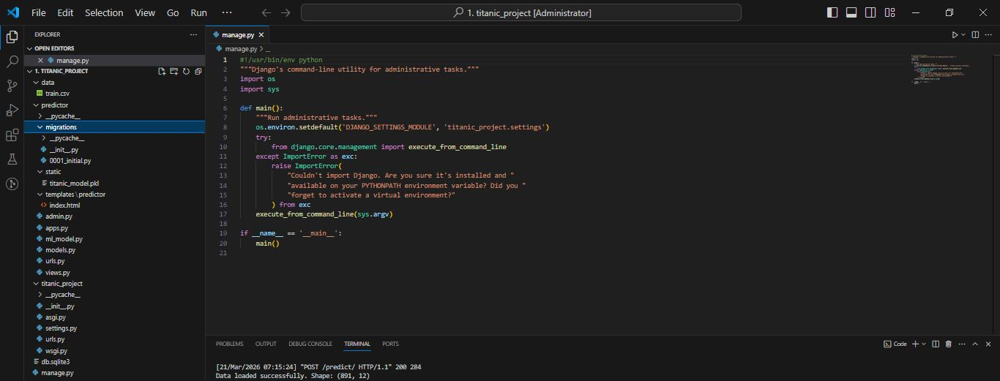
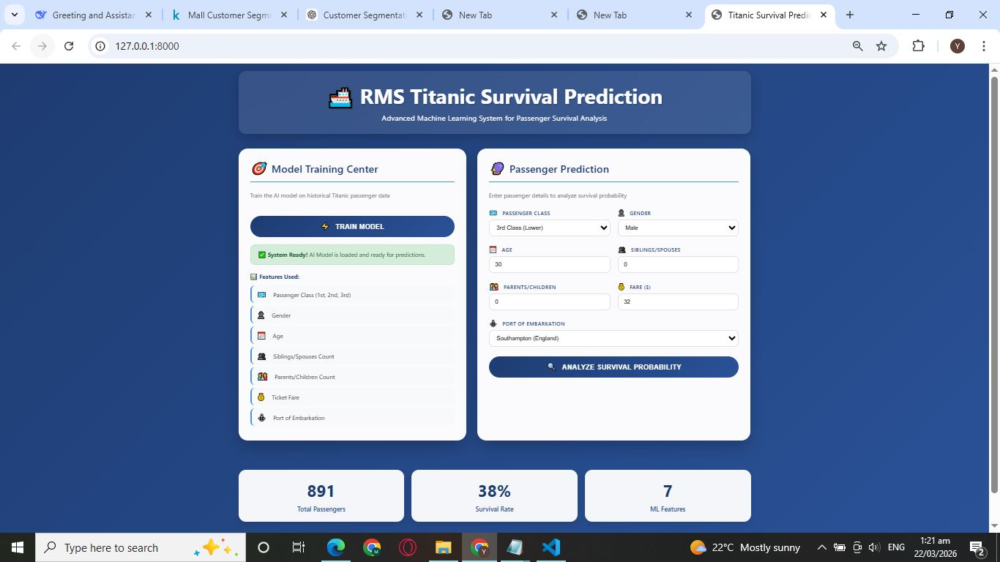
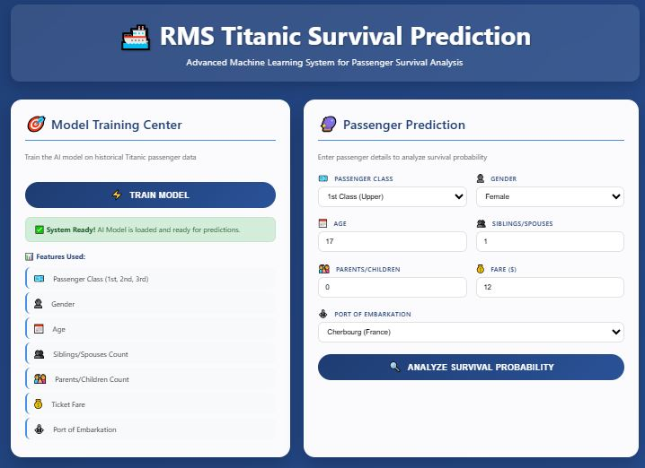
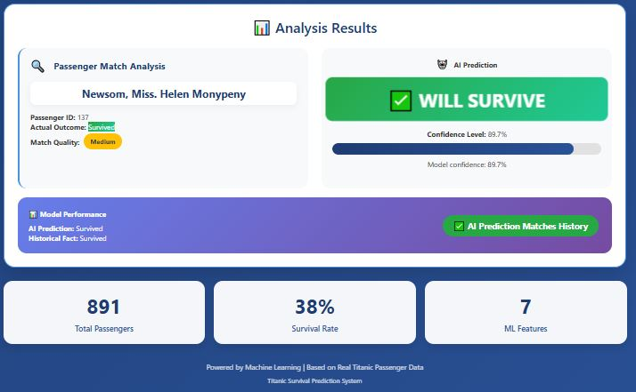

# 🚢 Titanic Survival Prediction - Machine Learning Project

[](https://www.python.org/)
[](https://www.djangoproject.com/)
[](https://scikit-learn.org/)
[](LICENSE)

A complete Machine Learning web application that predicts passenger survival on the Titanic using various ML algorithms. Built with Django and deployed with a beautiful user interface.

## 📊 Project Overview

This project uses the classic Titanic dataset to predict whether a passenger survived the Titanic disaster based on features like:
- Age
- Gender
- Passenger Class
- Fare
- Number of siblings/spouses aboard
- Number of parents/children aboard
- Embarkation port

The application provides an interactive web interface where users can input passenger details and get real-time survival predictions.

## 🎯 Features

- ✅ **Data Preprocessing**: Handles missing values, encodes categorical variables, and scales numerical features
- ✅ **Multiple ML Models**: Implements various algorithms including Logistic Regression, Random Forest, SVM, and Decision Trees
- ✅ **Model Persistence**: Saves trained model using pickle for efficient predictions
- ✅ **Interactive Web Interface**: User-friendly form to input passenger details
- ✅ **Real-time Predictions**: Instant survival predictions with probability scores
- ✅ **Model Evaluation**: Displays accuracy, precision, recall, and confusion matrix
- ✅ **Responsive Design**: Works on desktop and mobile devices

## 🏗️ Project Structure




## 📸 Screenshots

## GUI Interface


## Feature Selection


## Prediction Result


## 🚀 Installation & Setup

### Prerequisites

- Python 3.9 or higher
- pip package manager
- Git (optional)

### Step-by-Step Installation

1. **Clone the repository**
```bash
git clone https://github.com/Engr-Yasin-ai-04/titanic-survival-prediction.git
cd titanic-survival-prediction

### 📞 Contact & Support

**Author:** Engr Muhammad Yasin Khan  
**GitHub:** [Engr-Yasin-ai-04](https://github.com/Engr-Yasin-ai-04)  
**Support:** Use GitHub Issues

---

<div align="center">
Made with ❤️ by Engr Muhammad Yasin Khan  
AI & Machine Learning
</div>
